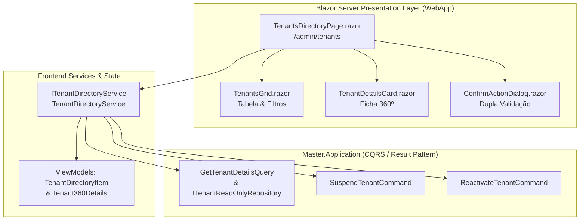

# Especificação da Interface de Diretório 360º (Blazor Server - Subfase 2.2)

## 1. Visão Geral

A **Interface de Diretório 360º no Blazor Server** constitui a estação de trabalho unificada do Super Admin para governança, monitoramento cadastral e controle de ciclo de vida de todos os inquilinos (*tenants*) da plataforma AdMetricsPro.

Desenvolvida sob o ecossistema **.NET 10 Interactive Server**, a interface opera sem exceções de negócio, ancorada estritamente no padrão `Result` / `Result<T>` e conectada à camada de aplicação via `ITenantDirectoryService` com suporte a in-memory dispatching (`MediatR` / `ISender`) e repositório analítico sem rastreamento (`ITenantReadOnlyRepository`).

---

## 2. Diagrama Arquitetural de Componentes



---

## 3. Catálogo de Componentes Atômicos

### 3.1 `TenantsGrid.razor`
* **Caminho:** `src/Frontend/WebApp/Components/Backoffice/TenantsGrid.razor`
* **Função:** Renderização tabular dos inquilinos com suporte a carregamento assíncrono, filtragem multifacetada e disparo de eventos de ciclo de vida.
* **Filtros Suportados:**
  * **Busca Textual em Tempo Real:** Pesquisa reativa por Razão Social, CNPJ (14 dígitos com ou sem máscara) e Subdomínio.
  * **Filtro de Status:** `Todos`, `Ativo` (`Active`), `Trial` (`Trial`), `Inadimplente` (`Delinquent`), `Suspenso` (`Suspended`), `Cancelado` (`Cancelled`).
  * **Filtro de Tier:** `Todos`, `Trial`, `Starter`, `Pro`, `Enterprise`.
* **Estados Visuais:**
  * **Carregamento:** Spinner e indicação de carregamento com `IsLoading = true`.
  * **Vazio (`Empty State`):** Exibição semântica com ícone e aviso quando nenhum item satisfaz os filtros.
  * **Populada:** Tabela responsiva com badges semânticos coloridos para status e tier.

### 3.2 `TenantDetailsCard.razor` (Ficha 360º)
* **Caminho:** `src/Frontend/WebApp/Components/Backoffice/TenantDetailsCard.razor`
* **Função:** Visualização completa em painel lateral (*drawer*) ou card dos dados fiscais, contratuais e métricas operacionais consolidadas.
* **Seções Exibidas:**
  1. **Dados Fiscais & Cadastrais:** Razão Social, CNPJ formatado (`XX.XXX.XXX/XXXX-XX`), Subdomínio (`{subdomain}.admetricspro.com.br`) e Domínio Customizado (CNAME).
  2. **Assinatura & Ciclo de Vida:** Tier contratado, Timestamp de provisionamento em UTC, vigência da assinatura e indicador de status com sinalização cromática.
  3. **Métricas Operacionais 360º:**
     * Workspaces Ativos.
     * Ad Spend Sincronizado consolidado (formatado em moeda nacional `pt-BR`).
     * Canais de Mídia Conectados (Meta Ads, Google Ads, Bing Ads, TikTok Ads).
     * Total de Campanhas Ativas monitoradas.
* **Ações Rápidas de Governança:**
  * Botão de Suspensão Forçada (visível se inquilino não suspenso).
  * Botão de Reativação Operacional (visível se inquilino suspenso).

### 3.3 `ConfirmActionDialog.razor` (Dupla Validação de Segurança)
* **Caminho:** `src/Frontend/WebApp/Components/Backoffice/ConfirmActionDialog.razor`
* **Função:** Modal de segurança para operações destrutivas ou de alto impacto operacional (suspensão de inquilino ou desconexão).
* **Mecanismo de Dupla Validação:**
  1. **Justificativa Formal Obrigatória:** Campo `textarea` com exigência de preenchimento de no mínimo 5 caracteres, registrado imutavelmente para auditoria.
  2. **Confirmação Textual Estrita:** Campo `input` que exige a digitação exata do identificador (ex.: subdomínio do inquilino).
  3. **Trava de Execução:** O botão `Confirmar Ação Destrutiva` permanece desabilitado (`disabled`) enquanto ambos os critérios não forem estritamente atendidos simultaneamente.

### 3.4 `TenantsDirectoryPage.razor` (Orquestrador)
* **Caminho:** `src/Frontend/WebApp/Components/Pages/Admin/TenantsDirectoryPage.razor`
* **Rota:** `@page "/admin/tenants"`
* **Função:** Dashboard executivo do Super Admin integrando os 4 cards de KPIs de governança:
  * Total de Inquilinos Cadastrados.
  * Inquilinos Ativos.
  * Inquilinos em Risco / Suspensos / Inadimplentes.
  * Volume Global de Ad Spend Gerenciado (BRL).

---

## 4. Contrato de Serviço de Frontend: `ITenantDirectoryService`

```csharp
public interface ITenantDirectoryService
{
    Task<Result<IReadOnlyList<TenantDirectoryItemViewModel>>> GetTenantsAsync(CancellationToken cancellationToken = default);
    Task<Result<Tenant360DetailsViewModel>> GetTenant360DetailsAsync(Guid tenantId, CancellationToken cancellationToken = default);
    Task<Result> SuspendTenantAsync(Guid tenantId, string reason, CancellationToken cancellationToken = default);
    Task<Result> ReactivateTenantAsync(Guid tenantId, CancellationToken cancellationToken = default);
}
```

* Retorno compulsório via `Result` / `Result<T>` da camada `BuildingBlocks.Domain.Primitives`.
* Isolamento de credenciais: nenhuma chamada projeta dados sensíveis (`EncryptedConnectionString`).

---

## 5. Cobertura de Testes com bUnit (TDD)

Todos os componentes possuem testes automatizados implementados com **bUnit**, **FluentAssertions** e **NSubstitute** em `tests/UnitTests/Frontend`:

| Classe de Teste | Quantidade | Cenários Validados |
| :--- | :--- | :--- |
| `TenantsGridTests` | 8 testes | Renderização de linhas, busca textual por nome/subdomínio, filtro por status, estado vazio, estado de carregamento e disparos de callbacks. |
| `TenantDetailsCardTests` | 6 testes | Renderização fiscal com máscara de CNPJ, métricas 360º, exibição condicional de botões de suspensão/reativação e callback de fechamento. |
| `ConfirmActionDialogTests` | 9 testes | Visibilidade, bloqueio inicial do botão, bloqueio quando apenas justificativa preenchida, bloqueio quando apenas texto preenchido, habilitação com ambos válidos, emissão de justificativa no callback, cancelamento e spinner de processamento. |
| `TenantsDirectoryPageTests` | 3 testes | Inicialização da página com KPIs, abertura da ficha 360º ao selecionar tenant e fluxo completo de suspensão forçada com dupla validação. |
