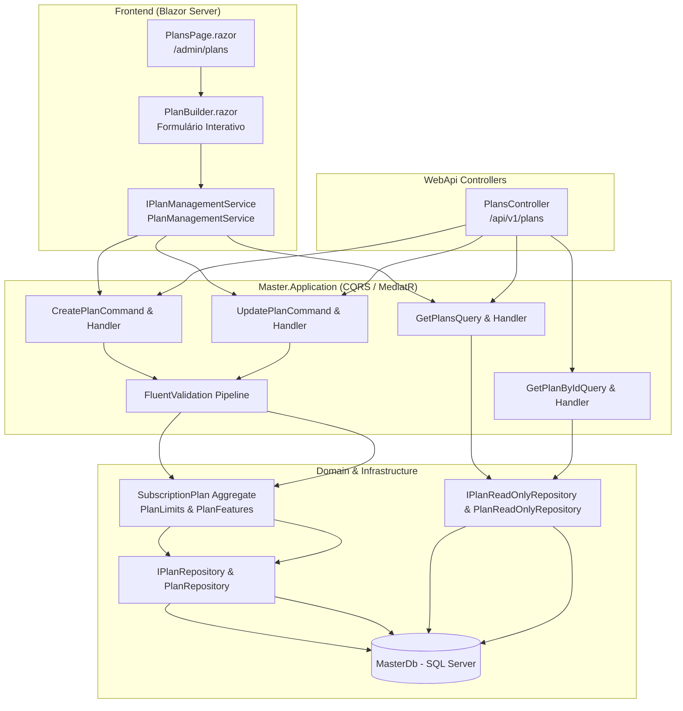

# Documentação Técnica: Construtor de Planos e Parametrização de Tiers (Subfase 3.1)

## 1. Visão Geral

A governança de planos e tiers de assinatura do SaaS AdMetricsPro é gerenciada de forma centralizada pelo módulo `Master` no banco de catálogo `MasterDb`. Esta funcionalidade (**Billing Master**) permite à diretoria e aos operadores do Super Admin:
- Parametrizar tiers comerciais (`Trial`, `Starter`, `Pro`, `Enterprise`).
- Definir cotas estruturais estritas: limites de assentos (*seats*), workspaces (*clientes*) e teto mensal de investimento em mídia sincronizado (*Ad Spend Cap*).
- Habilitar ou restringir recursos avançados via chaveamento seletivo (*Feature Flags* de plano): White-Label total, domínio personalizado CNAME, Copiloto de Inteligência Artificial e motor de regras de automação cross-network.
- Configurar precificação recorrente mensal e descontos contratuais para ciclos anuais.
- Cadastrar e atualizar planos dinamicamente via formulário visual no Blazor Server (`PlanBuilder.razor`).

Toda a arquitetura opera sob o padrão estrito `Result` / `Result<T>` sem lançar exceções de fluxo, com validações no pipeline via `FluentValidation`, persistência com EF Core e testes automatizados TDD (unitários, integração e bUnit).

---

## 2. Arquitetura de Comunicação e Handlers



---

## 3. Especificação dos Comandos (Write Stack)

### 3.1 `CreatePlanCommand`

Cadastra um novo plano comercial de assinatura com limites de uso, precificação e liberação funcional.

* **Interface:** `ICommand<PlanId>`
* **Regras de Validação (`CreatePlanCommandValidator`):**
  * `Name`: Obrigatório, máximo de 100 caracteres, único no catálogo global.
  * `Description`: Opcional, máximo de 500 caracteres.
  * `Tier`: Valor de enum válido (`Trial`, `Starter`, `Pro`, `Enterprise`).
  * `MonthlyPrice`: Maior ou igual a zero (R$ 0,00 para planos Trial).
  * `AnnualDiscountPercentage`: Inteiro entre 0 e 100%.
  * `MaxSeats`: Inteiro estritamente maior que zero.
  * `MaxWorkspaces`: Inteiro estritamente maior que zero.
  * `MonthlyAdSpendCap`: Maior ou igual a zero.

#### Payload de Entrada (JSON)
```json
{
  "name": "Agência Pro",
  "description": "Plano voltado para médias agências com gestão de múltiplos squads.",
  "tier": "Pro",
  "monthlyPrice": 499.00,
  "annualDiscountPercentage": 20,
  "maxSeats": 10,
  "maxWorkspaces": 5,
  "monthlyAdSpendCap": 50000.00,
  "hasWhiteLabel": true,
  "hasCustomCname": true,
  "hasAiCopilot": false,
  "hasCrossNetworkAutomations": true
}
```

#### Estrutura de Retorno em Sucesso (`Result<Guid>`)
```json
{
  "isSuccess": true,
  "isFailure": false,
  "value": "3fa85f64-5717-4562-b3fc-2c963f66afa6",
  "error": {
    "code": "",
    "description": "",
    "type": 0
  }
}
```

#### Erros de Negócio e Validação Mapeados
| Código do Erro | Tipo | Descrição |
| :--- | :--- | :--- |
| `Plan.NameRequired` | Validation | O nome do plano é obrigatório. |
| `Plan.InvalidSeats` | Validation | O limite de assentos deve ser maior que zero. |
| `Plan.InvalidWorkspaces` | Validation | O limite de workspaces deve ser maior que zero. |
| `Plan.InvalidAdSpendCap` | Validation | O teto de ad spend mensal não pode ser negativo. |
| `Plan.InvalidMonthlyPrice` | Validation | O preço mensal não pode ser negativo. |
| `Plan.InvalidAnnualDiscount` | Validation | O desconto anual deve estar entre 0 e 100%. |
| `Plan.NameAlreadyExists` | Conflict | Já existe um plano cadastrado com o mesmo nome. |

---

### 3.2 `UpdatePlanCommand`

Atualiza os limites estruturais, precificação e chaveamento funcional de um plano já cadastrado.

* **Interface:** `ICommand`
* **Regras de Validação (`UpdatePlanCommandValidator`):**
  * `PlanId`: Obrigatório (GUID não-vazio).
  * Mesmas restrições de nome, cotas e precificação aplicadas à criação.
  * Validação de unicidade de nome excluindo o próprio plano sendo editado.

#### Payload de Entrada (JSON)
```json
{
  "planId": "3fa85f64-5717-4562-b3fc-2c963f66afa6",
  "name": "Agência Pro Scale",
  "description": "Atualizado com liberação do Copiloto de IA.",
  "monthlyPrice": 599.00,
  "annualDiscountPercentage": 25,
  "maxSeats": 15,
  "maxWorkspaces": 8,
  "monthlyAdSpendCap": 75000.00,
  "hasWhiteLabel": true,
  "hasCustomCname": true,
  "hasAiCopilot": true,
  "hasCrossNetworkAutomations": true
}
```

#### Estrutura de Retorno em Sucesso (`Result`)
```json
{
  "isSuccess": true,
  "isFailure": false,
  "error": {
    "code": "",
    "description": "",
    "type": 0
  }
}
```

#### Erros de Negócio Mapeados
| Código do Erro | Tipo | Descrição |
| :--- | :--- | :--- |
| `Plan.NotFound` | NotFound | O plano informado não foi localizado no catálogo. |
| `Plan.NameAlreadyExists` | Conflict | Outro plano já utiliza o novo nome comercial. |

---

## 4. Especificação das Consultas (Read Stack)

### 4.1 `GetPlansQuery`

Consulta otimizada sem rastreamento (`AsNoTracking`) que projeta os planos diretamente para `PlanDto`.

* **Interface:** `IQuery<IReadOnlyList<PlanDto>>`
* **Parâmetro:** `IncludeInactive` (booleano, default `false`).
* **Estrutura do DTO:**
```csharp
public sealed record PlanDto(
    Guid Id,
    string Name,
    string Description,
    string Tier,
    decimal MonthlyPrice,
    int AnnualDiscountPercentage,
    int MaxSeats,
    int MaxWorkspaces,
    decimal MonthlyAdSpendCap,
    bool HasWhiteLabel,
    bool HasCustomCname,
    bool HasAiCopilot,
    bool HasCrossNetworkAutomations,
    bool IsActive,
    DateTime CreatedAtUtc,
    DateTime? UpdatedAtUtc);
```

---

## 5. Interface Blazor Server: `PlanBuilder.razor`

O componente interativo `PlanBuilder.razor` opera no modo **InteractiveServer** e permite à diretoria:
1. **Configuração Visual de Cotas:** Ajuste dinâmico de assentos, workspaces e teto de ad spend.
2. **Chaveamento de Feature Flags:** Switches visuais para White-Label, CNAME próprio, Copiloto de IA e Automações Cross-Network.
3. **Tratamento Reativo de Erros:** Exibição semântica de falhas via banner de erro sem interrupção de ciclo com exceção.
4. **Comunicação por EventCallbacks:** Emissão de `OnSaveSuccess` com o modelo atualizado e `OnCancel` para encerramento do diálogo.
