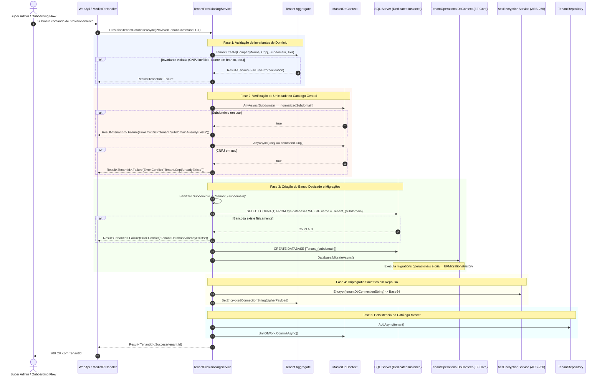

# Documentação Técnica: Engine de Provisionamento Dinâmico de Bancos de Tenant (Subfase 1.2)

## 1. Visão Geral

A **Engine de Provisionamento Dinâmico de Bancos de Tenant** (`TenantProvisioningService`) é o subsistema de infraestrutura e aplicação do módulo `Master` responsável pela criação autônoma e segura de ambientes dedicados para novos inquilinos (*tenants*) do SaaS AdMetricsPro.

O sistema adota o padrão arquitetural de isolamento físico estrito **Database-per-Tenant** em Microsoft SQL Server, garantindo isolamento completo de dados, ausência de risco de vazamento de informações entre concorrentes e compliance rigoroso (LGPD/GDPR).

---

## 2. Fluxo de Execução e Ciclo de Vida do Provisionamento

O provisionamento é coordenado pelo contrato `ITenantProvisioningService` implementado em `Master.Infrastructure.Services.TenantProvisioningService`:



---

## 3. Contratos de Entrada: `ProvisionTenantCommand`

O comando estruturado reside no namespace `Master.Application.Services`:

```csharp
/// <summary>
/// Structured command representing input parameters for provisioning a dedicated tenant database.
/// </summary>
/// <param name="CompanyName">Legal or commercial name of the tenant enterprise.</param>
/// <param name="Cnpj">CNPJ digits-only identifier (exactly 14 numeric characters).</param>
/// <param name="Subdomain">Designated routing subdomain for tenant isolation.</param>
/// <param name="Tier">Initial subscription tier. Defaults to <see cref="SubscriptionTier.Trial"/>.</param>
public sealed record ProvisionTenantCommand(
    string CompanyName,
    string Cnpj,
    string Subdomain,
    SubscriptionTier Tier = SubscriptionTier.Trial);
```

### Exemplo JSON de Entrada
```json
{
  "companyName": "Agência Growth Digital",
  "cnpj": "12345678000190",
  "subdomain": "growth-digital",
  "tier": "Trial"
}
```

---

## 4. Estrutura de Retorno (Padrão `Result<TenantId>`)

Nenhuma exceção é lançada para sinalizar erros de negócio ou validações. Todo retorno segue o padrão estrito `Result<T>`:

### Retorno de Sucesso (`IsSuccess = true`)
```json
{
  "isSuccess": true,
  "value": "e9b422a2-892d-4513-88ec-8f45c8be0876",
  "error": {
    "code": "",
    "description": "",
    "type": "None"
  }
}
```

### Retorno de Erro de Validação (`IsSuccess = false`, `ErrorType = Validation`)
```json
{
  "isSuccess": false,
  "value": null,
  "error": {
    "code": "Tenant.InvalidCnpj",
    "description": "CNPJ must contain exactly 14 digits.",
    "type": "Validation"
  }
}
```

### Retorno de Conflito de Catálogo (`IsSuccess = false`, `ErrorType = Conflict`)
```json
{
  "isSuccess": false,
  "value": null,
  "error": {
    "code": "Tenant.SubdomainAlreadyExists",
    "description": "Subdomain already exists in master catalog.",
    "type": "Conflict"
  }
}
```

---

## 5. Mapeamento de Erros de Negócio e Falhas Técnicas

| Código de Erro | Tipo | Causa Raiz | Ação Recomendada |
| :--- | :--- | :--- | :--- |
| `Tenant.CommandRequired` | `Validation` | O comando estruturado fornecido é nulo. | Fornecer payload válido. |
| `Tenant.CompanyNameRequired` | `Validation` | Razão social vazia ou em branco. | Preencher o nome da empresa. |
| `Tenant.InvalidCnpj` | `Validation` | CNPJ não possui exatamente 14 dígitos numéricos. | Sanitizar e enviar apenas números (14 dígitos). |
| `Tenant.InvalidSubdomain` | `Validation` | Subdomínio vazio ou contendo espaços/caracteres inválidos. | Usar apenas letras, números e hífen (`[a-z0-9-]`). |
| `Tenant.SubdomainAlreadyExists` | `Conflict` | Subdomínio já cadastrado na base central (`MasterDb`). | Escolher outro identificador de subdomínio. |
| `Tenant.CnpjAlreadyExists` | `Conflict` | CNPJ já possui cadastro ativo ou cancelado no catálogo. | Reativar cadastro existente ou contatar suporte. |
| `Tenant.ConnectionStringUnavailable` | `Validation` | Connection string do `MasterDb` ausente no ambiente. | Verificar configuração `ConnectionStrings:MasterDb`. |
| `Tenant.DatabaseAlreadyExists` | `Conflict` | Já existe fisicamente um banco SQL Server com o nome derivado. | Analisar orfandade de banco no SQL Server. |
| `Tenant.MigrationFailed` | `Failure` | Falha de DDL/migração durante `tenantContext.Database.MigrateAsync()`. | Verificar permissões do usuário SQL (`CREATE DATABASE`, `ALTER`) e scripts de migration. |

---

## 6. Segurança e Criptografia em Repouso (AES-256)

A string de conexão de cada banco dedicado (`EncryptedConnectionString`) **nunca** é gravada em texto plano no banco de dados do catálogo (`MasterDb`).

1. A connection string construída para o banco do tenant (`InitialCatalog = Tenant_{subdomain}`) é processada pelo serviço `IEncryptionService` (`AesEncryptionService`).
2. Utiliza **AES-256-CBC** com vetor de inicialização (IV) de 16 bytes gerado criptograficamente de forma aleatória a cada chamada, prevenindo ataques de dicionário e tabelas de frequência.
3. O payload concatenado `IV + Ciphertext` é codificado em Base64 e gravado na coluna `EncryptedConnectionString NVARCHAR(2000)` da tabela `Tenants`.
4. A chave simétrica mestra (`Security:MasterEncryptionKey`) é gerenciada via variáveis de ambiente/secret manager e possui 32 bytes (256 bits).

---

## 7. Sanitização de Nome de Banco de Dados

Para prevenir injeção de SQL em comandos DDL (`CREATE DATABASE [...]`), o subdomínio passa por higienização estrita:

1. Conversão para minúsculas (`ToLowerInvariant`).
2. Remoção de todos os caracteres não alfanuméricos exceto sublinhado através de expressão regular compilada: `[^a-zA-Z0-9_]+`.
3. Adição do prefixo canônico: `Tenant_{sanitized}`.
4. Uso de identificadores delimitados por colchetes no comando DDL: `CREATE DATABASE [{sanitizedDatabaseName}]`.
