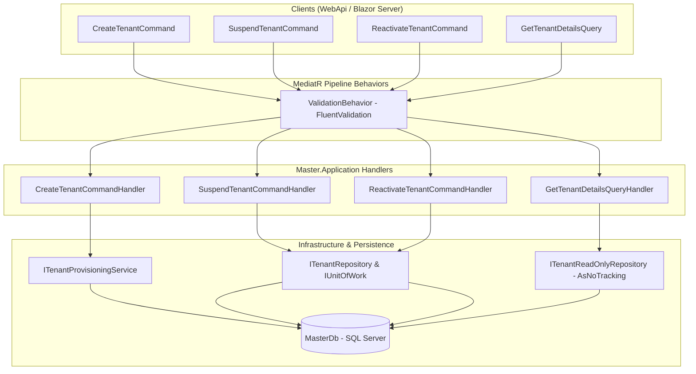

# Documentação Técnica: Comandos e Consultas de Tenants (Application Layer - Subfase 2.1)

## 1. Visão Geral

A camada de aplicação para gestão de tenants no módulo `Master` implementa o padrão **CQRS (Command Query Responsibility Segregation)** in-memory via `MediatR` com validação em pipeline desacoplada (`FluentValidation`), retorno estrito sob o pattern `Result` / `Result<T>` e repositório otimizado de leitura analítica (`ITenantReadOnlyRepository`).

Esta camada orquestra o ciclo de vida dos inquilinos (*tenants*) no SaaS AdMetricsPro, incluindo onboarding e provisionamento automático de instâncias dedicadas de banco de dados, suspensão operacional, reativação e consulta segura ao catálogo do diretório 360º.

---

## 2. Arquitetura de Comunicação e Handlers



---

## 3. Especificação dos Comandos (Write Stack)

### 3.1 `CreateTenantCommand`

Dispara o fluxo completo de onboarding, provisionando o banco dedicado físico e registrando o tenant no catálogo `MasterDb`.

* **Interface:** `ICommand<TenantId>`
* **Validação (`CreateTenantCommandValidator`):**
  * `CompanyName`: Obrigatório, máximo de 200 caracteres.
  * `Cnpj`: Obrigatório, exatamente 14 dígitos numéricos.
  * `Subdomain`: Obrigatório, máximo de 80 caracteres, sem espaços em branco.
  * `Tier`: Deve ser um enum válido (`Trial`, `Starter`, `Pro`, `Enterprise`).

#### Payload de Entrada (C# / JSON)
```json
{
  "companyName": "Agência Vanguarda Digital",
  "cnpj": "12345678000195",
  "subdomain": "vanguarda",
  "tier": "Pro"
}
```

#### Estrutura de Retorno em Sucesso (`Result<TenantId>`)
```json
{
  "isSuccess": true,
  "isFailure": false,
  "value": {
    "value": "3fa85f64-5717-4562-b3fc-2c963f66afa6"
  },
  "error": {
    "code": null,
    "description": null,
    "type": 0
  }
}
```

#### Erros de Negócio Mapeados
| Código do Erro | Tipo | Descrição |
| :--- | :--- | :--- |
| `Tenant.CompanyNameRequired` | Validation | O nome da empresa é obrigatório. |
| `Tenant.InvalidCnpj` | Validation | CNPJ deve conter exatamente 14 dígitos numéricos. |
| `Tenant.InvalidSubdomain` | Validation | Subdomínio inválido ou contendo espaços. |
| `Tenant.SubdomainAlreadyExists` | Conflict | Subdomínio já registrado no catálogo. |
| `Tenant.CnpjAlreadyExists` | Conflict | CNPJ já vinculado a outro tenant ativo. |
| `Tenant.DatabaseAlreadyExists` | Conflict | Banco SQL Server físico com mesmo nome já existente. |

---

### 3.2 `SuspendTenantCommand`

Interrompe as operações do inquilino (ex.: inadimplência ou violação de termos de uso), alterando seu status para `TenantStatus.Suspended`.

* **Interface:** `ICommand` (retorna `Result`)
* **Validação (`SuspendTenantCommandValidator`):**
  * `TenantId`: Não pode ser nulo ou vazio (`Guid.Empty`).
  * `Reason`: Obrigatório, até 500 caracteres.

#### Payload de Entrada
```json
{
  "tenantId": "3fa85f64-5717-4562-b3fc-2c963f66afa6",
  "reason": "Inadimplência após encerramento da régua de cobrança D+14."
}
```

#### Estrutura de Retorno em Sucesso (`Result`)
```json
{
  "isSuccess": true,
  "isFailure": false,
  "error": {
    "code": null,
    "description": null,
    "type": 0
  }
}
```

#### Erros de Negócio Mapeados
| Código do Erro | Tipo | Descrição |
| :--- | :--- | :--- |
| `Tenant.NotFound` | NotFound | Inquilino não localizado para o identificador fornecido. |
| `Tenant.SuspensionReasonRequired` | Validation | Motivo de suspensão deve ser informado. |

---

### 3.3 `ReactivateTenantCommand`

Restaura o inquilino previamente suspenso para o status `TenantStatus.Active`, permitindo login e retomada de sincronizações.

* **Interface:** `ICommand` (retorna `Result`)
* **Validação (`ReactivateTenantCommandValidator`):**
  * `TenantId`: Não pode ser nulo ou vazio (`Guid.Empty`).

#### Payload de Entrada
```json
{
  "tenantId": "3fa85f64-5717-4562-b3fc-2c963f66afa6"
}
```

#### Estrutura de Retorno em Sucesso (`Result`)
```json
{
  "isSuccess": true,
  "isFailure": false,
  "error": {
    "code": null,
    "description": null,
    "type": 0
  }
}
```

#### Erros de Negócio Mapeados
| Código do Erro | Tipo | Descrição |
| :--- | :--- | :--- |
| `Tenant.NotFound` | NotFound | Inquilino não localizado para o identificador fornecido. |

---

## 4. Especificação das Consultas (Read Stack)

### 4.1 `GetTenantDetailsQuery`

Obtém a projeção segura de dados cadastrais e operacionais do tenant para visualização no painel administrativo e Diretório 360º.

* **Interface:** `IQuery<TenantDetailsResponse>`
* **Garantia de Segurança:** Nunca projeta ou trafega o campo sensível `EncryptedConnectionString`.
* **Desempenho:** Executa via `ITenantReadOnlyRepository` usando `AsNoTracking()` do EF Core.

#### Payload de Entrada
```json
{
  "tenantId": "3fa85f64-5717-4562-b3fc-2c963f66afa6"
}
```

#### Estrutura de Retorno em Sucesso (`Result<TenantDetailsResponse>`)
```json
{
  "isSuccess": true,
  "isFailure": false,
  "value": {
    "id": "3fa85f64-5717-4562-b3fc-2c963f66afa6",
    "companyName": "Agência Vanguarda Digital",
    "cnpj": "12345678000195",
    "subdomain": "vanguarda",
    "status": "Active",
    "tier": "Pro",
    "subscriptionExpiresAtUtc": "2026-12-31T23:59:59Z",
    "createdAtUtc": "2026-09-03T12:00:00Z"
  },
  "error": {
    "code": null,
    "description": null,
    "type": 0
  }
}
```

#### Erros de Negócio Mapeados
| Código do Erro | Tipo | Descrição |
| :--- | :--- | :--- |
| `Tenant.NotFound` | NotFound | Inquilino não localizado para o identificador fornecido. |

---

## 5. Repositório de Leitura Otimizado (`ITenantReadOnlyRepository`)

Contrato implementado em `Master.Infrastructure.Repositories.TenantReadOnlyRepository`:

```csharp
public interface ITenantReadOnlyRepository
{
    Task<TenantDetailsResponse?> GetDetailsByIdAsync(TenantId id, CancellationToken cancellationToken = default);
    Task<IReadOnlyList<TenantDetailsResponse>> GetAllAsync(CancellationToken cancellationToken = default);
    Task<bool> ExistsAsync(TenantId id, CancellationToken cancellationToken = default);
}
```

Características arquiteturais:
1. **Zero Tracking:** Desativa o gerenciador de estados de entidades do EF Core via `.AsNoTracking()`.
2. **Projeção Direta em SQL:** Traduzida para `SELECT Id, CompanyName, Cnpj, Subdomain, Status, Tier, SubscriptionExpiresAtUtc, CreatedAtUtc FROM Tenants WHERE Id = @p0`.
3. **Isolamento de Credenciais:** O campo `EncryptedConnectionString` é omitido da projeção, prevenindo vazamentos de memória e serializações indevidas.
