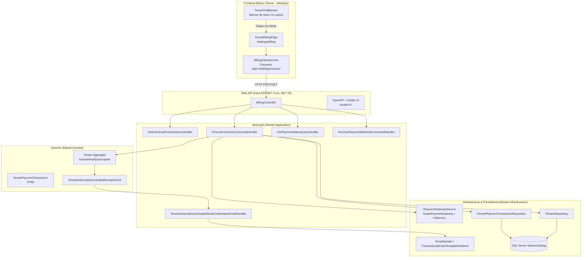

# Documentação Técnica: Checkout, Gateway de Pagamento e Transição de Trial para Assinatura Paga (Subfase 6.2)

## 1. Visão Geral

O módulo **Checkout, Gateway de Pagamento e Transição de Trial** concretiza o ciclo de faturamento e monetização do SaaS AdMetricsPro. Ele permite que qualquer agência que ingressou através do período de testes (*Trial*) converta sua conta para os planos comerciais definitivos (`Starter`, `Pro`, `Enterprise`) com recorrência mensal ou anual:

1. **Gateways de Pagamento Pluggáveis (`IPaymentGatewayService`):**
   - Suporte a **Cartão de Crédito** com aprovação instantânea e **Pix** com geração dinâmica de QR Code do Banco Central e chave Copia e Cola.
   - Implementação corporativa integrada com o gateway Asaas (`AsaasPaymentGateway`) e mock in-memory (`InMemoryPaymentGateway`) para ambientes de teste e CI/CD.
2. **Ativação Definitiva e Transição de Estado do Agregado `Tenant`:**
   - Ao liquidar a transação financeira, o inquilino transita de `TenantStatus.Trial` para `TenantStatus.Active`.
   - O plano (`Tier`), ciclo (`BillingCycle`), valor e data de expiração (`SubscriptionExpiresAtUtc` estendida em +30 dias ou +365 dias) são atualizados.
   - A régua de inadimplência/dunning é regularizada (`RegularizePayment()`).
   - O evento de domínio `TenantSubscriptionActivatedDomainEvent` é publicado pelo agregado, disparando a emissão do e-mail de confirmação e auditoria.
3. **Frontend Blazor Server Especializado (`/settings/billing`):**
   - Página interativa de faturamento com seletor de planos, alternador mensal/anual com badge de desconto (20% OFF) e checkout transparente.
   - Zero acesso direto a banco de dados, consumindo a Web API estritamente via cliente fortemente tipado `IBillingClientService`.
   - Banner de trial contextual (`TenantTrialBanner`) integrado ao `TenantState`, desaparecendo dinamicamente assim que a assinatura é ativada.

---

## 2. Diagrama de Arquitetura e Fluxo



---

## 3. Especificação dos Endpoints REST

### 3.1 Pré-visualização de Valores e Descontos de Checkout
- **Rota:** `GET /api/v1/billing/checkout/preview`
- **Query Params:**
  - `tenantId`: Guid do inquilino
  - `tier`: `Starter`, `Pro` ou `Enterprise`
  - `billingCycle`: `Monthly` ou `Annual`
- **Exemplo de Retorno (200 OK):**
```json
{
  "isSuccess": true,
  "isFailure": false,
  "error": { "code": "", "description": "", "type": 0 },
  "value": {
    "tier": 2,
    "planName": "Pro",
    "billingCycle": "Annual",
    "baseMonthlyPrice": 497.00,
    "discountPercentage": 20,
    "totalPayableNow": 4771.20,
    "savingsAmount": 1192.80,
    "nextRenewalDateUtc": "2027-09-08T01:30:00Z"
  }
}
```

### 3.2 Processamento de Checkout (Cartão ou Pix)
- **Rota:** `POST /api/v1/billing/checkout`
- **Payload de Entrada (Cartão de Crédito):**
```json
{
  "tenantId": "b18b456e-cf8e-4a6c-9ec6-8947b0a70192",
  "tier": 2,
  "billingCycle": "Monthly",
  "paymentMethod": 1,
  "cardHolderName": "Carlos Gestor",
  "cardNumber": "5555444433332222",
  "expiryMonth": "12",
  "expiryYear": "2029",
  "ccv": "123"
}
```
- **Exemplo de Retorno com Ativação Imediata (200 OK):**
```json
{
  "isSuccess": true,
  "isFailure": false,
  "error": { "code": "", "description": "", "type": 0 },
  "value": {
    "transactionId": "3fa85f64-5717-4562-b3fc-2c963f66afa6",
    "tenantId": "b18b456e-cf8e-4a6c-9ec6-8947b0a70192",
    "tier": 2,
    "billingCycle": "Monthly",
    "paymentMethod": 1,
    "amount": 497.00,
    "status": 2,
    "isActivated": true,
    "pixQrCode": null,
    "pixCopiaECola": null,
    "pixExpiresAtUtc": null,
    "failureReason": null
  }
}
```

### 3.3 Consulta de Status de Pagamento
- **Rota:** `GET /api/v1/billing/checkout/{transactionId}/status`
- **Exemplo de Retorno (200 OK):**
```json
{
  "isSuccess": true,
  "isFailure": false,
  "error": { "code": "", "description": "", "type": 0 },
  "value": {
    "transactionId": "3fa85f64-5717-4562-b3fc-2c963f66afa6",
    "status": 2,
    "isPaid": true,
    "paidAtUtc": "2026-09-08T01:30:00Z"
  }
}
```

### 3.4 Webhook de Gateway de Pagamento
- **Rota:** `POST /api/v1/billing/webhooks/{provider}`
- **Header:** `asaas-access-token: {segredo_configurado}`
- **Payload:** Evento JSON disparado pelo gateway (ex: `PAYMENT_RECEIVED`).
- **Comportamento:** Localiza a transação correspondente pelo ID externo do gateway, liquida a transação pendente, ativa a assinatura no `Tenant` correspondente e emite a confirmação por e-mail.
