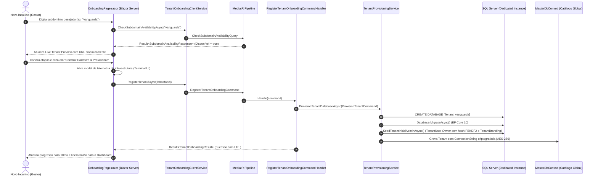

# Especificação Técnica — Onboarding & Provisionamento de Novo Tenant

> **Módulo:** Master / Frontend WebApp (Blazor Server .NET 10)  
> **Rotas:** `/register` e `/onboarding`  
> **Layout:** `LandingLayout.razor` (Full-width clean view)  
> **Design de Referência (Google Stitch):** Projeto ID `12765985270394356342` | Screen ID `3dbfaa4e77c64cfdab9dd6b167479b8e`  
> **Isolamento de Dados:** Database-per-Tenant (Instância física dedicada no Microsoft SQL Server).

---

## 1. Visão Geral

O módulo de **Onboarding & Provisionamento de Tenant** provê a experiência de autoatendimento (*Self-Service*) e registro guiado para novos assinantes e agências de performance do **AdMetricsPro**. 

A tela é concebida sob o padrão **Split-Screen (60% formulário progressivo / 40% live preview interativo)** com estética Dark Mode, efeitos glassmórficos (`backdrop-filter: blur(20px)`), acentos em violeta elétrico (`#4f46e5`), verde esmeralda (`#4edea3`) e ciano tecnológico (`#4cd7f6`), em conformidade total com o design gerado no Google Stitch.

---

## 2. Arquitetura de Comunicação e Fluxo de Dados



---

## 3. Especificação dos Contratos (Application & WebApi)

### 3.1 Consulta: `CheckSubdomainAvailabilityQuery`
* **Endpoint HTTP:** `GET /api/v1/tenants/check-subdomain?subdomain=vanguarda`
* **Descrição:** Valida em tempo real a unicidade do subdomínio pretendido e bloqueia termos reservados do sistema (`api`, `admin`, `app`, `master`, `auth`, etc.).

#### Retorno de Sucesso (`Result<SubdomainAvailabilityResponse>`):
```json
{
  "isSuccess": true,
  "isFailure": false,
  "value": {
    "subdomain": "vanguarda",
    "isAvailable": true,
    "reason": null,
    "suggestedAlternative": null
  },
  "error": { "code": null, "description": null, "type": 0 }
}
```

---

### 3.2 Consulta: `CheckTaxDocumentAvailabilityQuery`
* **Endpoint HTTP:** `GET /api/v1/tenants/check-document?document=529.982.247-25`
* **Descrição:** Valida em tempo real o formato, a integridade matemática dos dígitos verificadores (módulo 11) e a unicidade no catálogo Master tanto para **CPF (11 dígitos)** quanto para **CNPJ (14 dígitos)**.

#### Retorno de Sucesso (`Result<TaxDocumentAvailabilityResponse>`):
```json
{
  "isSuccess": true,
  "isFailure": false,
  "value": {
    "document": "52998224725",
    "formattedDocument": "529.982.247-25",
    "isValid": true,
    "isAvailable": true,
    "documentType": "CPF",
    "reason": null
  },
  "error": { "code": null, "description": null, "type": 0 }
}
```

---

### 3.3 Comando: `RegisterTenantOnboardingCommand`
* **Endpoint HTTP:** `POST /api/v1/tenants/onboarding`
* **Payload JSON de Entrada:**
```json
{
  "companyName": "Agência Vanguarda Digital Ltda",
  "cnpj": "12345678000195",
  "subdomain": "vanguarda",
  "segment": "Agência de Performance",
  "monthlyAdSpendRange": "R$ 20.000 a R$ 100.000 / mês",
  "tier": "Pro",
  "billingCycle": "Monthly",
  "adminFullName": "Carlos Mendes",
  "adminEmail": "carlos@vanguardadigital.com.br",
  "adminPhone": "11987654321",
  "adminPassword": "SenhaSegura#2026",
  "customDomain": "ads.vanguardadigital.com.br",
  "primaryColor": "#4f46e5",
  "secondaryColor": "#0f172a"
}
```

#### Retorno em Sucesso (`Result<TenantOnboardingResult>`):
```json
{
  "isSuccess": true,
  "isFailure": false,
  "value": {
    "tenantId": "3fa85f64-5717-4562-b3fc-2c963f66afa6",
    "companyName": "Agência Vanguarda Digital Ltda",
    "subdomain": "vanguarda",
    "accessUrl": "https://vanguarda.admetricspro.com.br/dashboard",
    "adminEmail": "carlos@vanguardadigital.com.br",
    "tier": "Pro"
  },
  "error": { "code": null, "description": null, "type": 0 }
}
```

#### Erros de Negócio e Validação Mapeados:
| Código do Erro | Tipo | Descrição |
| :--- | :--- | :--- |
| `Tenant.CompanyNameRequired` | Validation | Razão Social é obrigatória (máx. 200 caracteres). |
| `Tenant.InvalidCnpj` | Validation | Documento fiscal deve conter exatamente 11 dígitos (CPF) ou 14 dígitos (CNPJ) numéricos válidos. |
| `Tenant.InvalidSubdomain` | Validation | Subdomínio inválido ou contendo espaços em branco. |
| `Tenant.InvalidColorHex` | Validation | Cor primária ou secundária fora do formato hexadecimal (`#RRGGBB` ou `#RGB`). |
| `Tenant.InvalidCustomDomain` | Validation | Domínio CNAME personalizado contém protocolo (`http/https`) ou espaços. |
| `Tenant.InvalidBillingCycle` | Validation | Ciclo de faturamento deve ser `Monthly` ou `Annual`. |
| `Tenant.SubdomainAlreadyExists` | Conflict | O subdomínio informado já se encontra alocado por outro assinante. |
| `Tenant.CnpjAlreadyExists` | Conflict | O CPF ou CNPJ informado já possui um ambiente ativo no catálogo. |
| `Tenant.DatabaseAlreadyExists` | Conflict | Instância física de banco SQL Server já existente. |

#### Persistência no Catálogo Global (`MasterDb.Tenants`):
A partir da Subfase 1.1, todos os metadados cadastrais e de personalização coletados no wizard são persistidos diretamente na entidade `Tenant` no catálogo central:
- `Segment` (`nvarchar(100)`, opcional): Segmento de mercado (ex.: "Agência de Performance", "E-commerce").
- `MonthlyAdSpendRange` (`nvarchar(100)`, opcional): Faixa estimada de investimento em anúncios.
- `BillingCycle` (`nvarchar(50)`, opcional): Frequência do faturamento (`Monthly` ou `Annual`).
- `CustomDomain` (`nvarchar(255)`, opcional): Hostname CNAME configurado pelo assinante.
- `PrimaryColor` (`nvarchar(50)`, opcional): Cor primária customizada em formato hexadecimal.
- `SecondaryColor` (`nvarchar(50)`, opcional): Cor secundária customizada em formato hexadecimal.

#### Semeamento Automático no Banco Dedicado do Inquilino (`TenantDbContext`):
A partir da Subfase 1.3, o `TenantProvisioningService` executa o semeamento imediato e idempotente logo após o `MigrateAsync()`:
1. **`TenantBranding`:**
   - Registra as cores primária e secundária personalizadas informadas na etapa de identidade visual.
   - Aplica fallbacks corporativos seguros (`#4F46E5` e `#0F172A`) caso as cores não tenham sido informadas.
2. **`TenantUser` (Administrador / Owner):**
   - Cria o usuário com o perfil `TenantRole.Owner` e `IsActive = true`.
   - Hasheia a senha de forma criptograficamente segura via `IPasswordHasher` (PBKDF2 com salting dinâmico e HMAC-SHA256).
   - Preenche `FullName`, `Email` normalizado em caixa baixa e `PhoneNumber` comercial.

---

## 4. Componentização Frontend Blazor Server

Os componentes do onboarding residem em `src/Frontend/WebApp/Components/Onboarding/`:

| Componente | Responsabilidade |
| :--- | :--- |
| `OnboardingPage.razor` | Página raiz nas rotas `/register` e `/onboarding`. Gerencia o estado do wizard (passos 1 a 4) e orquestra a telemetria do modal de infraestrutura. |
| `OnboardingStepper.razor` | Barra superior de progresso com estados completados e ativo destacado. |
| `StepCompanyInfo.razor` | Etapa 1: Coleta de dados fiscais (Razão Social, CNPJ com máscara, segmento e volume em mídia). |
| `StepSubdomainIdentity.razor` | Etapa 2: Subdomínio com debounce assíncrono de disponibilidade, CNAME e paleta de cores. |
| `StepPlanSelection.razor` | Etapa 3: Switch mensal/anual e cards de planos (Starter, Pro em destaque glow e Enterprise). |
| `StepAdminAccount.razor` | Etapa 4: Dados do gestor, confirmação de senha com régua de força e aceite de termos LGPD. |
| `LiveTenantPreviewCard.razor` | Painel direito fixo com simulação em tempo real do ambiente do cliente, URL, mini cockpit e selos de segurança. |
| `ProvisioningConsoleModal.razor` | Modal em tela cheia com spinner circular, terminal de telemetria em tempo real e CTA de acesso. |

---

## 5. Estratégia de Testes Automatizados (TDD)

- **Backend (`tests/UnitTests/Backend/Tenants/`):**
  - `CheckSubdomainAvailabilityQueryHandlerTests.cs`: Valida subdomínio disponível, reservado e duplicado com sugestão.
  - `RegisterTenantOnboardingCommandTests.cs`: Valida regras estritas do FluentValidation e execução do handler.
- **Frontend (`tests/UnitTests/Frontend/Components/Onboarding/`):**
  - `OnboardingPageTests.cs`: Valida renderização inicial, bloqueio de avanço sem dados obrigatórios, estados do stepper e reatividade do preview lateral.
