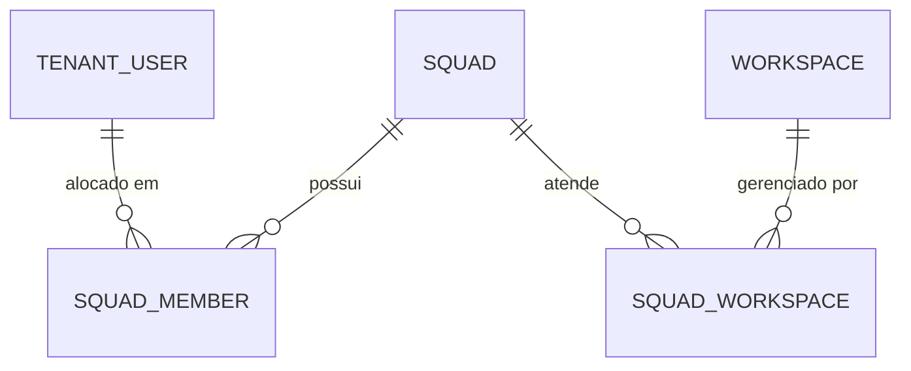

# Módulo Tenants — Gestão de Squads & Isolamento por Carteira (Portfolio Isolation)

Este documento descreve as diretrizes arquiteturais, modelos de persistência, regras de governança de acesso e contratos da Web API para a **Gestão de Squads (Times Internos)** e **Isolamento por Carteira de Clientes** no contexto de banco de dados dedicado por inquilino (`TenantDbContext`).

---

## 1. Visão Geral e Arquitetura

Em agências de tráfego pago, a organização do trabalho ocorre através de células operacionais chamadas **Squads**. Um Squad reúne gestores de mídia, líderes operacionais e analistas dedicados a atender um conjunto específico de clientes gerenciados (**Workspaces**).

### 1.1 Entidades e Relacionamentos
- **`Squad` (Agregado Raiz):** Identificado por `Id`, com `Name`, `Description`, `IsActive` e timestamps UTC.
- **`SquadMember` (Entidade Associativa):** Representa a alocação de um colaborador (`TenantUser`) ao Squad.
- **`SquadWorkspace` (Entidade Associativa):** Representa a alocação de um cliente gerenciado (`Workspace`) à carteira do Squad.
- **Modelo Matricial N:N:** Um colaborador pode pertencer a múltiplos squads, e um workspace pode ter atendimento compartilhado entre squads (ex: Squad de Aquisição + Squad de Retenção).



---

## 2. Regras de Isolamento por Carteira (Portfolio Isolation)

A governança do **AdMetricsPro** estabelece isolamento granular de visibilidade e operação com base no papel funcional (`TenantRole`):

| Papel (`TenantRole`) | Categoria de Acesso | Política de Isolamento por Carteira |
| :--- | :--- | :--- |
| **Owner** | Governança Global | Acesso total e irrestrito a **todos** os workspaces do tenant. |
| **Admin** | Administrativo Global | Acesso total e irrestrito a **todos** os workspaces do tenant. |
| **SquadLeader** | Operacional de Squad | Acesso restrito aos workspaces vinculados aos seus squads ativos. |
| **MediaManager** | Operacional de Campanha | Acesso restrito aos workspaces vinculados aos seus squads ativos. |
| **Analyst** | Auditoria e Performance | Acesso restrito aos workspaces vinculados aos seus squads ativos. |
| **Guest** | Observador Externo | Acesso restrito aos workspaces vinculados aos seus squads ativos. |

### 2.1 Cenários de Governança:
1. **Analista sem Squad:** Possui carteira vazia (acesso zero a clientes da agência).
2. **Analista no Squad A:** Enxerga e opera apenas os clientes alocados no Squad A. Tentativas de acessar clientes exclusivos do Squad B são bloqueadas.
3. **Analista em Múltiplos Squads:** Enxerga a união de todas as carteiras de clientes dos squads ativos aos quais pertence.
4. **Colaborador Inativo:** Bloqueio imediato de qualquer acesso à carteira (`User.Inactive`).

---

## 3. Endpoints da Web API (`/api/v1/squads`)

Todos os endpoints requerem resolução de contexto de inquilino (`X-Tenant-Id`) e retornam envelopes tipados no padrão `Result<T>`.

### 3.1 Cadastrar Novo Squad
- **Rota:** `POST /api/v1/squads`
- **Sumário OpenAPI:** `Cadastra um novo time/squad interno na agência`
- **Status:** `201 Created`, `400 BadRequest`, `401 Unauthorized`, `409 Conflict`

#### Payload de Requisição (`CreateSquadApiRequest`):
```json
{
  "name": "Squad E-commerce Performance",
  "description": "Célula focada em grandes contas de varejo e lojas virtuais"
}
```

#### Retorno de Sucesso (`201 Created`):
```json
{
  "isSuccess": true,
  "isFailure": false,
  "error": { "code": "", "description": "", "type": 0 },
  "value": "3fa85f64-5717-4562-b3fc-2c963f66afa6"
}
```

---

### 3.2 Listar Squads da Agência
- **Rota:** `GET /api/v1/squads?activeOnly=true`
- **Sumário OpenAPI:** `Lista os squads da agência com métricas de membros e clientes`
- **Status:** `200 OK`

#### Retorno de Sucesso:
```json
{
  "isSuccess": true,
  "isFailure": false,
  "error": { "code": "", "description": "", "type": 0 },
  "value": [
    {
      "id": "3fa85f64-5717-4562-b3fc-2c963f66afa6",
      "name": "Squad E-commerce Performance",
      "description": "Célula focada em grandes contas de varejo e lojas virtuais",
      "isActive": true,
      "memberCount": 4,
      "workspaceCount": 12,
      "createdAtUtc": "2026-09-07T14:15:00Z"
    }
  ]
}
```

---

### 3.3 Obter Detalhes do Squad
- **Rota:** `GET /api/v1/squads/{id}`
- **Sumário OpenAPI:** `Obtém os detalhes completos de um squad`
- **Status:** `200 OK`, `404 NotFound`

---

### 3.4 Adicionar Membro ao Squad
- **Rota:** `POST /api/v1/squads/{id}/members`
- **Sumário OpenAPI:** `Adiciona um colaborador ao squad`
- **Status:** `200 OK`, `400 BadRequest`, `404 NotFound`, `409 Conflict`

```json
{
  "userId": "c5f5a89b-987d-411a-8c87-8df7618efb32"
}
```

---

### 3.5 Alocar Workspace ao Squad
- **Rota:** `POST /api/v1/squads/{id}/workspaces`
- **Sumário OpenAPI:** `Aloca um cliente/workspace à carteira do squad`
- **Status:** `200 OK`, `400 BadRequest`, `404 NotFound`, `409 Conflict`

```json
{
  "workspaceId": "d6e6b90c-098e-522b-9d98-9ef8729fac43"
}
```

---

### 3.6 Consultar Carteira de Clientes do Colaborador
- **Rota:** `GET /api/v1/squads/users/{userId}/portfolio`
- **Sumário OpenAPI:** `Obtém os clientes acessíveis a um colaborador segundo regras de isolamento por carteira`
- **Status:** `200 OK`, `404 NotFound`

Retorna a lista de `WorkspaceDto` que o colaborador está autorizado a acessar.

---

## 4. Tabela de Erros de Negócio Mapeados

| Código de Erro | Tipo | Cenário de Ocorrência |
| :--- | :--- | :--- |
| `Squad.EmptyName` | Validation | Nome do squad nulo ou em branco. |
| `Squad.NameTooLong` | Validation | Nome excede 100 caracteres. |
| `Squad.DescriptionTooLong` | Validation | Descrição excede 500 caracteres. |
| `Squad.NotFound` | NotFound | Squad não localizado no inquilino. |
| `Squad.NameAlreadyExists` | Conflict | Já existe squad cadastrado com o mesmo nome no inquilino. |
| `Squad.MemberAlreadyExists` | Conflict | Colaborador já vinculado a este squad. |
| `Squad.MemberNotFound` | NotFound | Colaborador não pertence à equipe do squad. |
| `Squad.WorkspaceAlreadyAssigned` | Conflict | Workspace já alocado na carteira deste squad. |
| `Squad.WorkspaceNotAssigned` | NotFound | Workspace não alocado na carteira deste squad. |
| `User.NotFound` | NotFound | Colaborador não existe no inquilino. |
| `User.Inactive` | Validation | Colaborador inativo não pode ser alocado ou acessar carteira. |
| `Workspace.NotFound` | NotFound | Cliente/workspace não encontrado no inquilino. |
| `Workspace.Inactive` | Validation | Workspace pausado/inativo não pode ser alocado a um squad. |
