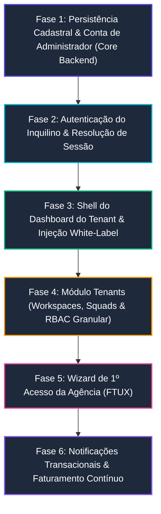

# Roadmap de Implementação: Gaps do Onboarding da Agência (Tenant)

Este documento estabelece o diagnóstico completo dos gaps existentes no processo de **Onboarding e Provisionamento de Agências (Inquilinos/Tenants)** do **AdMetricsPro**, definindo o plano de ação técnico e a **ordem cronológica estrita de implementação**, em conformidade com as diretrizes do `AGENTS.md` (.NET 10, Blazor Server, Monólito Modular, Database-per-Tenant, Pattern `Result<T>`, TDD estrito e Documentação Viva).

---

## 1. Diagnóstico do Estado Atual vs. Gaps Identificados

O onboarding atual provê uma interface de alta fidelidade e executa com sucesso o provisionamento do banco físico dedicado no SQL Server. No entanto, há quebras de integridade funcional após o provisionamento:

| Componente / Dado Coletado | Estado no Wizard (Frontend) | Estado no Backend | Gap / Problema Técnico |
| :--- | :--- | :--- | :--- |
| **Credenciais do Gestor** (`AdminFullName`, `AdminEmail`, `AdminPassword`) | Coletados e validados no `StepAdminAccount.razor` | Recebidos pelo comando `RegisterTenantOnboardingCommand` | **NENHUM usuário é criado**. O banco provisionado fica sem conta de login ativa para a agência. |
| **Dados de Identidade Visual** (`PrimaryColor`, `SecondaryColor`, `CustomDomain`) | Selecionados no `StepSubdomainIdentity.razor` | Recebidos pelo comando | **Descartados no Handler**. A entidade `Tenant` no `MasterDb` e o banco do tenant não persistem essas propriedades. |
| **Segmento e Ad Spend** (`Segment`, `MonthlyAdSpendRange`) | Coletados no `StepCompanyInfo.razor` | Recebidos pelo comando | **Descartados no Handler**. Não há gravação para inteligência de onboarding ou classificação da agência. |
| **Ciclo de Cobrança** (`BillingCycle: Monthly/Annual`) | Escolhido no `StepPlanSelection.razor` | Recebido pelo comando | **Descartado**. Não há persistência da intenção de faturamento para quando os 14 dias de Trial expirarem. |
| **Estrutura Operacional** (`TenantDbContext`) | Simula telemetria de criação | Banco físico criado com `Database.MigrateAsync()` | O `TenantDbContext` contém **apenas a tabela `TenantSchemaMarkers`**. Não possui tabelas de usuários, workspaces ou squads. |
| **Redirecionamento Final** (`/dashboard`) | Botão final aponta para `https://{subdomain}.admetricspro.com.br/dashboard` | Rota não mapeada no `WebApp` | **Erro 404 (Not Found)**. Não existe dashboard do inquilino nem página de `/login` para autenticar o gestor. |
| **Configuração Inicial da Agência (FTUX)** | Inexistente | Inexistente | A agência não possui um fluxo guiado para cadastrar o primeiro cliente, squad ou conectar contas de mídia (Meta/Google). |

---

## 2. Ordem Sequencial de Implementação dos Gaps

A implementação deve seguir estritamente a sequência de dependências arquiteturais descrita abaixo, garantindo que cada fase construa os pré-requisitos da etapa seguinte através do ciclo **Red-Green-Refactor (TDD)**.



---

### Fase 1: Persistência Cadastral, Marca & Criação do Administrador (Core Backend)

**Objetivo:** Garantir que nenhum dado preenchido no onboarding seja perdido e que a agência nasça com seu usuário *Owner* registrado com senha segura no seu banco dedicado.

#### Subfase 1.1: Expansão da Entidade `Tenant` no Catálogo Global (`MasterDb`) — [CONCLUÍDO]
1. [x] **TDD (Red):** Testes unitários implementados em `TenantTests.cs` cobrindo campos opcionais em `Tenant`: `CustomDomain`, `PrimaryColor`, `SecondaryColor`, `Segment`, `MonthlyAdSpendRange` e `BillingCycle`, além de validações hex de cor, sanitização de CNAME e ciclos aceitos.
2. [x] **TDD (Green):** Entidade `Tenant` e métodos de fábrica `Tenant.Create(...)`, `UpdateBranding(...)`, `UpdateBusinessProfile(...)` e `SetBillingCycle(...)` implementados com o pattern `Result<T>` e documentação XML integral.
3. [x] **Mapeamento EF Core:** `TenantEntityTypeConfiguration.cs` atualizado no `Master.Infrastructure` com limites estritos (`HasMaxLength`) e nulabilidade; migração `20260907100000_Add_TenantOnboardingProfileAndBranding` criada e `MasterDbContextModelSnapshot.cs` sincronizado.
4. [x] **Atualização do Provisioning:** `ProvisionTenantCommand` e `TenantProvisioningService` atualizados para gravar esses metadados no `MasterDb`; `RegisterTenantOnboardingCommandHandler` atualizado para repassar 100% dos dados coletados no formulário de onboarding. Suíte de testes de compliance arquitetural e XML executada com sucesso.

#### Subfase 1.2: Modelagem Inicial do Banco do Tenant (`TenantDbContext`)
1. **Entidade `TenantUser`:** Criar entidade com `Id`, `FullName`, `Email`, `PhoneNumber`, `PasswordHash`, `Role` (enum `TenantRole`: Owner, Admin, SquadLeader, MediaManager, Analyst, Guest), `IsActive`, `CreatedAtUtc`.
2. **Entidade `TenantBranding`:** Criar entidade para guardar paleta de cores (`PrimaryColor`, `SecondaryColor`), URL de logomarca claro/escuro e favicon.
3. **Mapeamento no `TenantDbContext`:** Configurar tabelas `TenantUsers` e `TenantBranding` no EF Core e atualizar a migração base do banco de tenant.

#### Subfase 1.3: Semeador Automático no Provisionamento
1. **TDD (Red):** Testar o método `SeedTenantInitialAdminAsync` garantindo que o usuário *Owner* seja criado no banco dedicado recém-provisionado com hash seguro (PBKDF2/Argon2 via `IPasswordHasher`).
2. **TDD (Green):** Implementar a rotina no `TenantProvisioningService` para, imediatamente após o `tenantContext.Database.MigrateAsync()`, inserir o registro do `TenantUser` (Owner) e o `TenantBranding` inicial.

---

### Fase 2: Autenticação do Inquilino & Resolução de Sessão (Tenant Auth)

**Objetivo:** Permitir que o gestor da agência faça login no seu ambiente dedicado (seja por subdomínio ou e-mail/senha).

#### Subfase 2.1: Serviço de Autenticação de Inquilino (`TenantAuthService`)
1. **TDD (Red):** Testes unitários para `AuthenticateTenantUserCommand`:
   * Identificar o tenant contextual (via subdomínio na URL ou header).
   * Validar credenciais contra `TenantDbContext.TenantUsers`.
   * Bloquear usuários inativos ou com senha incorreta.
   * Emitir claims de identidade: `UserId`, `Email`, `FullName`, `TenantId`, `Role` (`Owner`).
2. **TDD (Green):** Implementar `AuthenticateTenantUserCommandHandler` e geração de token JWT assinado.

#### Subfase 2.2: Tela de Login do Inquilino (`/login` no `WebApp`)
1. **Componente `TenantLoginPage.razor`:**
   * Página dedicada nas rotas `/login`.
   * Resolução automática do subdomínio: se acessado por `vanguarda.admetricspro.com.br`, carrega dinamicamente as cores e o nome da agência.
   * Validação reativa de campos e retorno do padrão `Result`.
2. **Autologin Pós-Provisionamento:**
   * Opção no final do wizard de onboarding para realizar login transparente ou emitir o token de sessão antes de navegar para o cockpit.

---

### Fase 3: Shell do Dashboard do Tenant & Injeção White-Label

**Objetivo:** Eliminar o erro 404 pós-onboarding e fornecer a casca visual da aplicação operacional com identidade visual dinâmica.

#### Subfase 3.1: Layout Base do Tenant (`TenantMainLayout.razor`)
1. **Tema Dinâmico (White-Label CSS):**
   * Injetar variáveis CSS globais (`--tenant-primary-color`, `--tenant-secondary-color`) extraídas do `TenantBranding` da sessão.
   * Renderizar logomarca customizada ou fallback com iniciais da agência na sidebar/topbar.
2. **Barra de Navegação Operacional:**
   * Itens: Visão Geral (Dashboard), Clientes (Workspaces), Times (Squads), Integrações de Anúncios, Configurações White-Label.
3. **Banner Informativo de Trial:**
   * Alerta superior amigável: *"Ambiente de Testes (Trial) — 14 dias restantes. [Ativar Plano Definitivo]"*.

#### Subfase 3.2: Página de Visão Geral (`/dashboard`)
1. **Componente `TenantDashboardPage.razor`:**
   * Header com boas-vindas: *"Olá, [Nome do Gestor]! Bem-vindo à sua central de tráfego."*
   * Cards de métricas zeradas (estado inicial vazio elegante / Empty State).

---

### Fase 4: Módulo `Tenants` no Backend (Workspaces, Squads & RBAC Granular)

**Objetivo:** Implementar a hierarquia organizacional que sustenta o modelo de negócio de agências de tráfego pago.

#### Subfase 4.1: Gestão de Workspaces (Clientes da Agência)
1. **Agregado `Workspace`:**
   * Entidade: `Id`, `Name`, `CnpjOrCpf`, `MonthlyAdSpendBudget`, `Segment`, `CreatedAtUtc`, `IsActive`.
   * Validação de cotas: checar se o número de workspaces ativos respeita o teto do plano contratado (`Starter`: 3, `Pro`: 15, `Enterprise`: Ilimitado).
2. **Comando `CreateWorkspaceCommand`:**
   * Handler no módulo `Tenants`, repositório `IWorkspaceRepository`, persistência em `TenantDbContext`.

#### Subfase 4.2: Gestão de Squads (Times Internos)
1. **Agregado `Squad`:**
   * Entidade: `Id`, `Name`, `Description`, `CreatedAtUtc`.
   * Vínculos: Associação de membros (`TenantUser`) e clientes (`Workspace`).
2. **Isolamento por Carteira:**
   * Garantir que analistas atribuídos ao "Squad A" não tenham acesso aos dados dos clientes do "Squad B".

---

### Fase 5: Wizard de Primeiro Acesso da Agência (FTUX — First-Time User Experience)

**Objetivo:** Guiar a agência recém-cadastrada nas quatro configurações essenciais para começar a rodar tráfego na plataforma.

#### Subfase 5.1: Checklist Interativo de Onboarding Operacional
Exibido no topo do `/dashboard` até que todas as 4 etapas fundamentais sejam concluídas (progresso 0% a 100%):

```text
[ Progresso da Configuração: 25% ] 
 ├── [✓] Passo 1: Conta provisionada e ambiente isolado criado
 ├── [ ] Passo 2: Cadastre seu 1º Cliente (Workspace)
 ├── [ ] Passo 3: Conecte sua 1ª Conta de Anúncios (Meta ou Google Ads)
 └── [ ] Passo 4: Convide um gestor ou crie seu 1º Squad
```

1. **Passo 2 — Assistente de 1º Workspace:** Modal rápido para criar o primeiro cliente com nome e orçamento.
2. **Passo 3 — Assistente de 1ª Conexão:** Tela com botões OAuth2 de Meta Ads e Google Ads (com opção de "Carregar Dados Demonstrativos" para visualização imediata).
3. **Passo 4 — Assistente de Equipe:** Modal para convidar colaboradores informando e-mail e cargo (Gestor ou Analista).

---

### Fase 6: Notificações Transacionais & Faturamento Contínuo (Billing Lifecycle)

**Objetivo:** Automatizar a retenção comercial e a comunicação com a agência.

#### Subfase 6.1: Mensageria & E-mails Transacionais
1. **E-mail de Boas-Vindas:** Disparado logo após o provisionamento com link direto para o subdomínio da agência (`https://{subdomain}.admetricspro.com.br/login`).
2. **Lembretes de Fim de Trial:** Notificações automáticas aos 7, 3 e 1 dia(s) antes do vencimento dos 14 dias de teste.

#### Subfase 6.2: Transição de Trial para Assinatura Paga
1. **Checkout & Gateway:** Integração com gateway de pagamentos (Asaas, Stripe ou Pagar.me) para cartão de crédito e Pix.
2. **Ativação Definitiva:** Atualização do status do `Tenant` de `Trial` para `Active` e registro da recorrência conforme ciclo selecionado no onboarding (`Monthly` ou `Annual`).

---

## 3. Matriz de Entregáveis por Camada da Aplicação

| Camada / Projeto | Arquivos a Criar / Modificar | Tipo de Teste (TDD) |
| :--- | :--- | :--- |
| `Master.Domain` | Atualizar `Tenant.cs` com campos de branding, segmento e billing. | Unitários (`TenantTests.cs`) |
| `Master.Application` | Atualizar `RegisterTenantOnboardingCommandHandler.cs` para repassar todos os campos. | Unitários (`RegisterTenantOnboardingCommandTests.cs`) |
| `BuildingBlocks.Infrastructure` | Expandir `TenantDbContext.cs` mapeando `TenantUser`, `TenantBranding` e `Workspace`. | Integração EF Core |
| `Master.Infrastructure` | Atualizar `TenantProvisioningService.cs` para semear o usuário Owner com senha hasheada. | Integração com Testcontainers SQL Server |
| `WebApp (Frontend)` | Criar `TenantLoginPage.razor`, `TenantMainLayout.razor` e `TenantDashboardPage.razor`. | bUnit (`TenantLoginPageTests.cs`, `TenantDashboardTests.cs`) |
| `WebApp (Components)` | Criar `AgencyFtuxChecklist.razor` para o assistente de 1º acesso no dashboard. | bUnit (`AgencyFtuxChecklistTests.cs`) |
| `docs/` | Atualizar `docs/modules/tenant-onboarding.md` e criar `docs/modules/tenant-dashboard.md`. | Documentação Viva e XML Docs |
