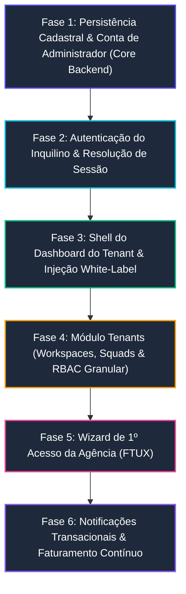

# Roadmap de Implementação: Gaps do Onboarding da Agência (Tenant)

Este documento estabelece o diagnóstico completo dos gaps existentes no processo de **Onboarding e Provisionamento de Agências (Inquilinos/Tenants)** do **AdMetricsPro**, definindo o plano de ação técnico e a **ordem cronológica estrita de implementação**, em conformidade com as diretrizes do `AGENTS.md` (.NET 10, Blazor Server, Monólito Modular, Database-per-Tenant, Pattern `Result<T>`, TDD estrito e Documentação Viva).

---

## 1. Diagnóstico do Estado Atual vs. Gaps Identificados

O onboarding atual provê uma interface de alta fidelidade e executa com sucesso o provisionamento do banco físico dedicado no SQL Server. No entanto, há quebras de integridade funcional após o provisionamento:

| Componente / Dado Coletado | Estado no Wizard (Frontend) | Estado no Backend | Gap / Problema Técnico |
| :--- | :--- | :--- | :--- |
| **Credenciais do Gestor** (`AdminFullName`, `AdminEmail`, `AdminPassword`) | Coletados e validados no `StepAdminAccount.razor` | Recebidos pelo comando `RegisterTenantOnboardingCommand` | **NENHUM usuário é criado**. O banco provisionado fica sem conta de login ativa para a agência. |
| **Dados de Identidade Visual** (`PrimaryColor`, `SecondaryColor`, `CustomDomain`) | Selecionados no `StepSubdomainIdentity.razor` | Recebidos pelo comando | **Descartados no Handler**. A entidade `Tenant` no `MasterDb` e o banco do tenant não persistem essas propriedades. |
| **Segmento e Ad Spend** (`Segment`, `MonthlyAdSpendRange`) | Coletados no `StepCompanyInfo.razor` | Recebidos pelo comando | **Descartados no Handler**. Não há gravação para inteligência de onboarding ou classificação da agência. |
| **Ciclo de Cobrança** (`BillingCycle: Monthly/Annual`) | Escolhido no `StepPlanSelection.razor` | Recebido pelo comando | **Descartado**. Não há persistência da intenção de faturamento para quando os 14 dias de Trial expirarem. |
| **Estrutura Operacional** (`TenantDbContext`) | Simula telemetria de criação | Banco físico criado com `Database.MigrateAsync()` | O `TenantDbContext` contém **apenas a tabela `TenantSchemaMarkers`**. Não possui tabelas de usuários, workspaces ou squads. |
| **Redirecionamento Final** (`/dashboard`) | Botão final aponta para `https://{subdomain}.admetricspro.com.br/dashboard` | Rota não mapeada no `WebApp` | **Erro 404 (Not Found)**. Não existe dashboard do inquilino nem página de `/login` para autenticar o gestor. |
| **Configuração Inicial da Agência (FTUX)** | Inexistente | Inexistente | A agência não possui um fluxo guiado para cadastrar o primeiro cliente, squad ou conectar contas de mídia (Meta/Google). |

---

## 2. Ordem Sequencial de Implementação dos Gaps

A implementação deve seguir estritamente a sequência de dependências arquiteturais descrita abaixo, garantindo que cada fase construa os pré-requisitos da etapa seguinte através do ciclo **Red-Green-Refactor (TDD)**.



---

### Fase 1: Persistência Cadastral, Marca & Criação do Administrador (Core Backend)

**Objetivo:** Garantir que nenhum dado preenchido no onboarding seja perdido e que a agência nasça com seu usuário *Owner* registrado com senha segura no seu banco dedicado.

#### Subfase 1.1: Expansão da Entidade `Tenant` no Catálogo Global (`MasterDb`) — [CONCLUÍDO]
1. [x] **TDD (Red):** Testes unitários implementados em `TenantTests.cs` cobrindo campos opcionais em `Tenant`: `CustomDomain`, `PrimaryColor`, `SecondaryColor`, `Segment`, `MonthlyAdSpendRange` e `BillingCycle`, além de validações hex de cor, sanitização de CNAME e ciclos aceitos.
2. [x] **TDD (Green):** Entidade `Tenant` e métodos de fábrica `Tenant.Create(...)`, `UpdateBranding(...)`, `UpdateBusinessProfile(...)` e `SetBillingCycle(...)` implementados com o pattern `Result<T>` e documentação XML integral.
3. [x] **Mapeamento EF Core:** `TenantEntityTypeConfiguration.cs` atualizado no `Master.Infrastructure` com limites estritos (`HasMaxLength`) e nulabilidade; migração `20260907100000_Add_TenantOnboardingProfileAndBranding` criada e `MasterDbContextModelSnapshot.cs` sincronizado.
4. [x] **Atualização do Provisioning:** `ProvisionTenantCommand` e `TenantProvisioningService` atualizados para gravar esses metadados no `MasterDb`; `RegisterTenantOnboardingCommandHandler` atualizado para repassar 100% dos dados coletados no formulário de onboarding. Suíte de testes de compliance arquitetural e XML executada com sucesso.

#### Subfase 1.2: Modelagem Inicial do Banco do Tenant (`TenantDbContext`) — [CONCLUÍDO]
1. [x] **TDD (Red):** Testes unitários implementados em `TenantUserTests.cs` e `TenantBrandingTests.cs` cobrindo todas as invariantes e validações das entidades (formatos hexadecimais, e-mail regex, restrições de tamanho, hashing seguro e ciclo de ativação). Testes de modelo em `TenantDbContextModelTests.cs` cobrindo restrições de colunas, índices únicos e conversões.
2. [x] **TDD (Green):** Entidades `TenantUser`, `TenantBranding` e enum `TenantRole` criadas no Kernel compartilhado (`BuildingBlocks.Domain/Tenants`) seguindo o padrão `Result<T>` sem exceptions e documentação XML `<summary>` integral.
3. [x] **Mapeamento EF Core:** Configurações fluentes `TenantUserEntityTypeConfiguration.cs` e `TenantBrandingEntityTypeConfiguration.cs` adicionadas em `BuildingBlocks.Infrastructure`, e `DbSet` correspondentes expostos no `TenantDbContext.cs`.
4. [x] **Migração Operacional:** Migração `20260907110000_Add_TenantUserAndTenantBranding` gerada em `Master.Infrastructure` e `TenantOperationalDbContextModelSnapshot.cs` sincronizado para aplicação automática durante o provisionamento. 100% dos 575 testes passando com sucesso.

#### Subfase 1.3: Semeador Automático no Provisionamento — [CONCLUÍDO]
1. [x] **TDD (Red):** Testes unitários implementados em `PasswordHasherTests.cs` cobrindo geração de hash PBKDF2/HMAC-SHA256, salting dinâmico e validação de tempo constante. Testes de contrato em `ProvisionTenantCommand_WithAdminCredentials` e repasse em `RegisterTenantOnboardingCommandTests.cs`. Testes unitários em `TenantProvisioningServiceTests.cs` cobrindo `SeedTenantInitialAdminAsync` com isolamento por SQLite in-memory (Owner, role correta, hash verificado, branding com fallback e idempotência).
2. [x] **TDD (Green):** Interface `IPasswordHasher` e implementação `PasswordHasher` registradas em `BuildingBlocks`. `ProvisionTenantCommand` expandido com `AdminFullName`, `AdminEmail`, `AdminPhone` e `AdminPassword`. Método `SeedTenantInitialAdminAsync` implementado no `TenantProvisioningService` e executado imediatamente após `tenantContext.Database.MigrateAsync()`.
3. [x] **Teste de Integração (SQL Server Real):** Teste `ProvisionTenantDatabaseAsync_WithAdminAndBranding_ShouldSeedOwnerUserAndBranding` executado com sucesso via Testcontainers, atestando a persistência física das tabelas `TenantUsers` e `TenantBranding` no banco dedicado. 100% dos testes unitários, de integração e de compliance XML aprovados.

---

### Fase 2: Autenticação do Inquilino & Resolução de Sessão (Tenant Auth)

**Objetivo:** Permitir que o gestor da agência faça login no seu ambiente dedicado (seja por subdomínio ou e-mail/senha).

#### Subfase 2.1: Serviço de Autenticação de Inquilino (`TenantAuthService`) — [CONCLUÍDO]
1. [x] **TDD (Red):** Testes unitários para `AuthenticateTenantUserCommandValidator`, `AuthenticateTenantUserCommandHandler`, `TenantAuthService` e `TenantJwtTokenService`:
   * Identificar o tenant contextual (via subdomínio na URL, header `X-Tenant-Id` ou parâmetro no comando).
   * Validar credenciais contra `TenantDbContext.TenantUsers` via `ITenantDbContextFactory` e `ITenantConnectionResolver`.
   * Bloquear inquilinos inativos/suspensos (`Tenant.Inactive`) e contas de usuário inativas (`Auth.AccountInactive`) ou com senha incorreta via `IPasswordHasher` (`Auth.InvalidCredentials`).
   * Emitir claims de identidade: `UserId` (`sub`), `Email`, `FullName` (`name`), `TenantId` (`tenant_id`), `TenantSubdomain` (`tenant_subdomain`), `Role` (`Owner`).
2. [x] **TDD (Green):** Módulo `Tenants.Application` e `Tenants.Infrastructure` criados em .NET 10. `AuthenticateTenantUserCommandHandler`, `TenantAuthService` e `TenantJwtTokenService` implementados retornando o padrão estrito `Result<T>`.
3. [x] **Endpoint Web API:** Exposição de `POST /api/v1/tenants/auth/login` em `TenantAuthController` documentado via OpenAPI/Scalar com `[EndpointSummary]` e códigos de status HTTP semânticos (200, 400, 401, 422).
4. [x] **Documentação & Compliance:** Documento `/docs/modules/tenants-authentication.md` criado com exemplos JSON e regras de segurança; 100% de conformidade com comentários XML e testes de arquitetura do `AGENTS.md`. 100% dos 692 testes da solução passando com sucesso.

#### Subfase 2.2: Tela de Login do Inquilino (`/login` no `WebApp`) — [CONCLUÍDO]
1. [x] **TDD (Red):** Testes unitários para `GetTenantPublicBrandingQueryHandlerTests` e `TenantAuthControllerTests` cobrindo o endpoint `GET /api/v1/tenants/auth/branding`. Testes unitários para `TenantAuthClientServiceTests` e `TenantSessionStateProviderTests`. Testes de tela bUnit em `TenantLoginPageTests` cobrindo renderização, resolução de subdomínio, validação reativa e redirecionamento.
2. [x] **TDD (Green):** Endpoint `GET /api/v1/tenants/auth/branding` e query `GetTenantPublicBrandingQuery` implementados no backend. Cliente HTTP fortemente tipado `ITenantAuthClientService` / `TenantAuthClientService` e provedor de sessão `ITenantSessionStateProvider` / `TenantSessionStateProvider` implementados no `WebApp`.
3. [x] **Componente `TenantLoginPage.razor`:** Tela de login responsiva em tema escuro com glassmorphism, suporte a detecção de subdomínio por URL host ou query parameter, injeção dinâmica de CSS variables de White-Label (`--tenant-primary`), validação reativa e retorno estrito do padrão `Result<T>`.
4. [x] **Autologin Pós-Provisionamento:** `OnboardingPage.razor` atualizado para autenticar automaticamente as credenciais do novo gestor após a criação do banco de dados dedicado, gravando a sessão no circuito e direcionando o botão do modal de provisionamento diretamente para o `/dashboard`. 100% de conformidade XML e suíte de testes aprovada.

---

### Fase 3: Shell do Dashboard do Tenant & Injeção White-Label

**Objetivo:** Eliminar o erro 404 pós-onboarding e fornecer a casca visual da aplicação operacional com identidade visual dinâmica.

#### Subfase 3.1: Layout Base do Tenant (`TenantMainLayout.razor`) — [CONCLUÍDO]
1. [x] **Tema Dinâmico (White-Label CSS):**
   * Variáveis CSS globais (`--tenant-primary-color`, `--tenant-secondary-color`, `--tenant-accent-color`) injetadas no elemento raiz do layout a partir do `TenantBranding` do estado de sessão.
   * Renderização de logomarca customizada quando presente ou monograma de fallback com as iniciais da agência na sidebar e topbar.
2. [x] **Barra de Navegação Operacional (`TenantSidebar.razor`):**
   * Itens mandatários implementados: Visão Geral (`/dashboard`), Clientes (`/workspaces`), Times (`/squads`), Integrações de Anúncios (`/integrations`), Configurações White-Label (`/settings/white-label`).
   * Suporte a drawer móvel com overlay, transições CSS e botão toggle no cabeçalho (`TenantTopHeader.razor`).
3. [x] **Banner Informativo de Trial (`TenantTrialBanner.razor`):**
   * Alerta superior amigável: *"Ambiente de Testes (Trial) — 14 dias restantes. [Ativar Plano Definitivo]"*, com ação de upgrade e capacidade de dispensar na sessão.
4. [x] **TDD & Cobertura bUnit:** 11 novos testes criados em `TenantMainLayoutTests`, `TenantSidebarTests` e `TenantTrialBannerTests`; 100% de testes passando. Documentação viva registrada em `/docs/modules/tenants-dashboard-shell.md`.

#### Subfase 3.2: Página de Visão Geral (`/dashboard`) — [CONCLUÍDO]
1. [x] **Componente `TenantDashboardPage.razor`:**
   * Header operacional com boas-vindas: *"Olá, [Nome do Gestor]! Bem-vindo à sua central de tráfego."*, consumindo `ITenantSessionStateProvider` com fallback inteligente para "Gestor".
   * Cards de métricas zeradas (estado inicial vazio elegante / Empty State): Investimento Total (`R$ 0,00`), Receita (`R$ 0,00`), ROAS (`0,00x`), MER (`0,00%`), Cliques & Impressões (`0 / 0`) e CPA Médio (`R$ 0,00`).
   * Banner de onboarding FTUX (First-Time User Experience) com atalhos para conectar fontes de anúncios (`/integrations`), criar workspace (`/workspaces`) e estruturar times (`/squads`).
   * Painel de monitoramento das 4 plataformas mandatárias de anúncios (Meta Ads, Google Ads, TikTok Ads e Bing Ads) em estado desconectado com ações rápidas.
2. [x] **TDD & Cobertura bUnit:** 7 novos testes criados em `TenantDashboardPageTests.cs` cobrindo saudação, fallback, cards de métricas, empty state, redes suportadas e reatividade do circuito Blazor. 100% de testes passando.
3. [x] **Documentação & Compliance:** Documento `/docs/modules/tenants-dashboard-overview.md` criado; conformidade total com regras de apresentação e isolamento do `AGENTS.md`.

---

### Fase 4: Módulo `Tenants` no Backend (Workspaces, Squads & RBAC Granular)

**Objetivo:** Implementar a hierarquia organizacional que sustenta o modelo de negócio de agências de tráfego pago.

#### Subfase 4.1: Gestão de Workspaces (Clientes da Agência) — [CONCLUÍDO]
1. [x] **Agregado `Workspace`:**
   * Entidade: `Id`, `Name`, `CnpjOrCpf`, `MonthlyAdSpendBudget`, `Segment`, `CreatedAtUtc`, `IsActive`.
   * Validação de cotas: checagem inter-módulos in-memory via MediatR (`GetTenantPlanLimitsQuery`), respeitando o teto do plano contratado (`Starter`: 3, `Pro`: 15, `Enterprise`: Ilimitado).
2. [x] **Comandos e Consultas (`Tenants.Application`):**
   * Handlers no módulo `Tenants`, repositório `IWorkspaceRepository`, `ITenantUnitOfWork` e persistência no `TenantDbContext`.
   * Suporte a `CreateWorkspaceCommand`, `UpdateWorkspaceCommand`, `ToggleWorkspaceStatusCommand`, `GetWorkspacesQuery` e `GetWorkspaceByIdQuery`.
3. [x] **Web API REST & OpenAPI/Scalar (`WorkspacesController`):**
   * Endpoints `/api/v1/workspaces` com envelopes `Result<T>` padronizados e documentação OpenAPI.
4. [x] **TDD & Cobertura Completa:**
   * 32 testes unitários de domínio e aplicação e 4 testes de aceitação de endpoints; 100% de testes passando sem regressões. Documentação viva em `/docs/modules/tenants-workspaces.md`.

#### Subfase 4.2: Gestão de Squads (Times Internos)
1. **Agregado `Squad`:**
   * Entidade: `Id`, `Name`, `Description`, `CreatedAtUtc`.
   * Vínculos: Associação de membros (`TenantUser`) e clientes (`Workspace`).
2. **Isolamento por Carteira:**
   * Garantir que analistas atribuídos ao "Squad A" não tenham acesso aos dados dos clientes do "Squad B".

---

### Fase 5: Wizard de Primeiro Acesso da Agência (FTUX — First-Time User Experience)

**Objetivo:** Guiar a agência recém-cadastrada nas quatro configurações essenciais para começar a rodar tráfego na plataforma.

#### Subfase 5.1: Checklist Interativo de Onboarding Operacional
Exibido no topo do `/dashboard` até que todas as 4 etapas fundamentais sejam concluídas (progresso 0% a 100%):

```text
[ Progresso da Configuração: 25% ] 
 ├── [✓] Passo 1: Conta provisionada e ambiente isolado criado
 ├── [ ] Passo 2: Cadastre seu 1º Cliente (Workspace)
 ├── [ ] Passo 3: Conecte sua 1ª Conta de Anúncios (Meta ou Google Ads)
 └── [ ] Passo 4: Convide um gestor ou crie seu 1º Squad
```

1. **Passo 2 — Assistente de 1º Workspace:** Modal rápido para criar o primeiro cliente com nome e orçamento.
2. **Passo 3 — Assistente de 1ª Conexão:** Tela com botões OAuth2 de Meta Ads e Google Ads (com opção de "Carregar Dados Demonstrativos" para visualização imediata).
3. **Passo 4 — Assistente de Equipe:** Modal para convidar colaboradores informando e-mail e cargo (Gestor ou Analista).

---

### Fase 6: Notificações Transacionais & Faturamento Contínuo (Billing Lifecycle)

**Objetivo:** Automatizar a retenção comercial e a comunicação com a agência.

#### Subfase 6.1: Mensageria & E-mails Transacionais
1. **E-mail de Boas-Vindas:** Disparado logo após o provisionamento com link direto para o subdomínio da agência (`https://{subdomain}.admetricspro.com.br/login`).
2. **Lembretes de Fim de Trial:** Notificações automáticas aos 7, 3 e 1 dia(s) antes do vencimento dos 14 dias de teste.

#### Subfase 6.2: Transição de Trial para Assinatura Paga
1. **Checkout & Gateway:** Integração com gateway de pagamentos (Asaas, Stripe ou Pagar.me) para cartão de crédito e Pix.
2. **Ativação Definitiva:** Atualização do status do `Tenant` de `Trial` para `Active` e registro da recorrência conforme ciclo selecionado no onboarding (`Monthly` ou `Annual`).

---

## 3. Matriz de Entregáveis por Camada da Aplicação

| Camada / Projeto | Arquivos a Criar / Modificar | Tipo de Teste (TDD) |
| :--- | :--- | :--- |
| `Master.Domain` | Atualizar `Tenant.cs` com campos de branding, segmento e billing. | Unitários (`TenantTests.cs`) |
| `Master.Application` | Atualizar `RegisterTenantOnboardingCommandHandler.cs` para repassar todos os campos. | Unitários (`RegisterTenantOnboardingCommandTests.cs`) |
| `BuildingBlocks.Infrastructure` | Expandir `TenantDbContext.cs` mapeando `TenantUser`, `TenantBranding` e `Workspace`. | Integração EF Core |
| `Master.Infrastructure` | Atualizar `TenantProvisioningService.cs` para semear o usuário Owner com senha hasheada. | Integração com Testcontainers SQL Server |
| `WebApp (Frontend)` | Criar `TenantLoginPage.razor`, `TenantMainLayout.razor` e `TenantDashboardPage.razor`. | bUnit (`TenantLoginPageTests.cs`, `TenantDashboardTests.cs`) |
| `WebApp (Components)` | Criar `AgencyFtuxChecklist.razor` para o assistente de 1º acesso no dashboard. | bUnit (`AgencyFtuxChecklistTests.cs`) |
| `docs/` | Atualizar `docs/modules/tenant-onboarding.md` e criar `docs/modules/tenant-dashboard.md`. | Documentação Viva e XML Docs |
